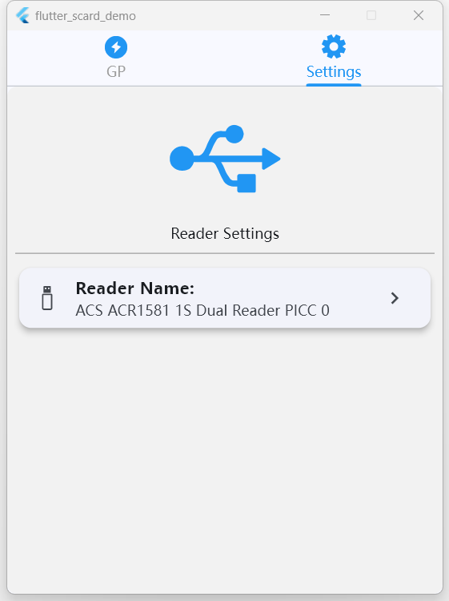
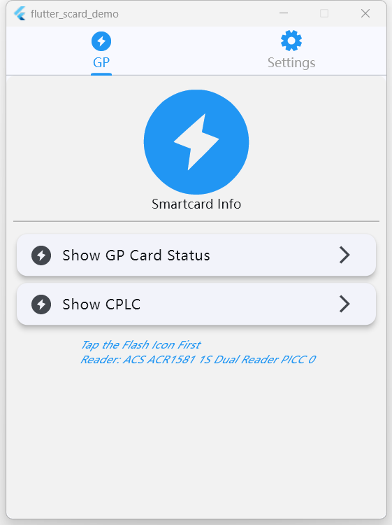
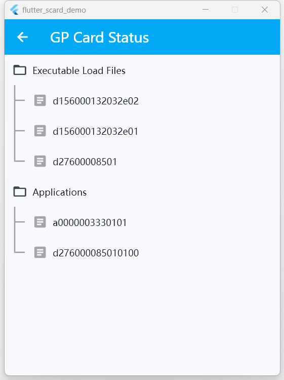
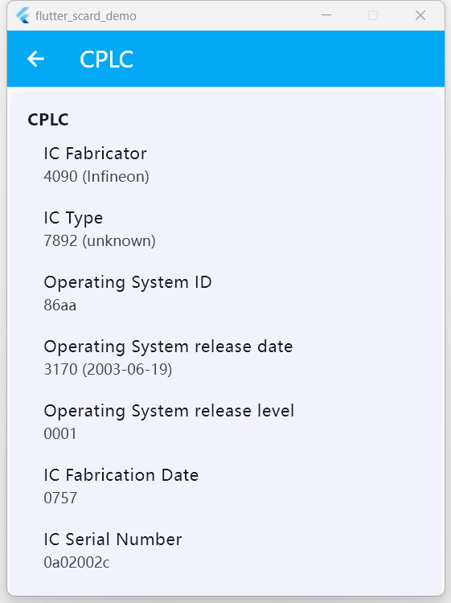
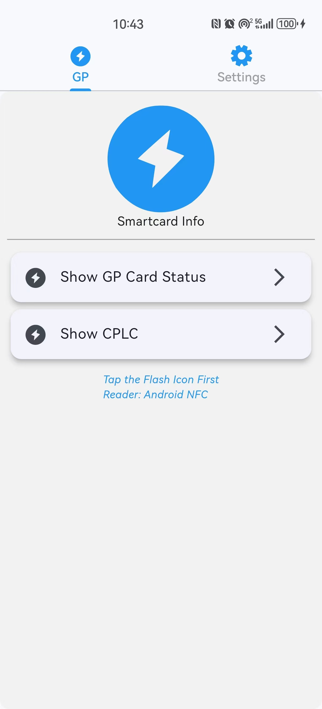

# flutter_scard_demo

## 1. Introduction
smartcard access demo using nfc (android) or pcsc (windows), including a simple global platform scp02 impl.

- for android platform, we use [flutter_nfc_kit](https://github.com/nfcim/flutter_nfc_kit) to access a GP-enabled picc, such as a javacard.

- for windows platform, we use [flutter_pcsc](https://github.com/fabienrousseau/flutter_pcsc), which is modified to support ccid escape channel and a reset() method on Windows platform. see flutter_pcsc folder for details.

- for GP scp02 simple implementation, we can get card cplc, list, uninstall, install card contents.

- if you want to use USB-OTG to access a ccid token/device on android platform, you may check some vendors solutions:
  - [ACS](https://github.com/AdvancedCardSystems/ACS) (ACS Sample Code & SDK for Android)
  - [Feitian](https://github.com/FeitianSmartcardReader/FEITIAN_MOBILE_READERS) (FEITIAN_MOBILE_READERS) 
  - [HID Global](https://www.hidglobal.com/drivers/32404) (HID® OMNIKEY® Android Driver 1.9)
  - [Identiv](https://support.identiv.com/developer-tools-for-smart-card-readers/) (Android CCID Library)
  - [SpringCard](https://github.com/springcard/android-pcsclike) (PC/SC Like Android library, __not_sure__ OTG supported)   

## 2. How to Build
You should have Flutter SDK, Visual Studio and Android Studio installed. Then launch a terminal to run:
``` cmd
flutter build windows
 
flutter build apk
```
to get windows binary and android apk.

## 3. How to Use
### 3.1 On Windows platform
- select a pcsc reader in the 'settings' screen
  
  
- read gp-enabled card in the 'GP' screen 
  
  

  click on the blue-flash icon 
- then you can see cplc or card contents
  
  
  
  
### 3.2 On Android platform
Things like 3.1, but we use the only Android NFC Reader, so we can click on the blue-flash icon directly.

  
  

## 4 about the CCID Escape and Reset
You can see demo_app/lib/utls/reader.dart

```dart
// cold/warm reset a smartcard, pcsc only!! 
// return an ATR if successed
String reset(bool cold);

// send escape commands to ccid device, not a smartcard.
// see https://ludovicrousseau.blogspot.com/2011/10/featureccidesccommand.html
// https://tech.springcard.com/2013/scardcontrol-linux-and-java/
RApdu escape(String capdu, int timeout);

```

<br />

---
.NFC 2024/07/03
